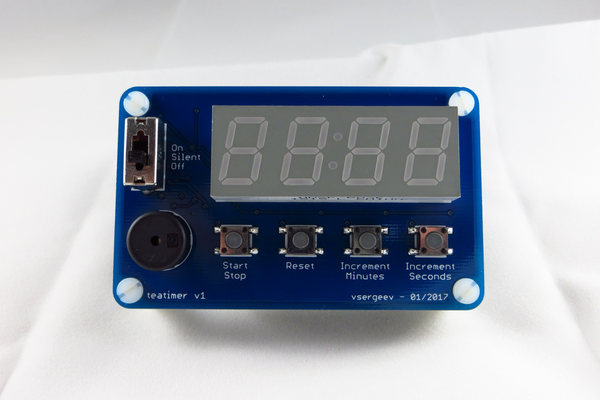
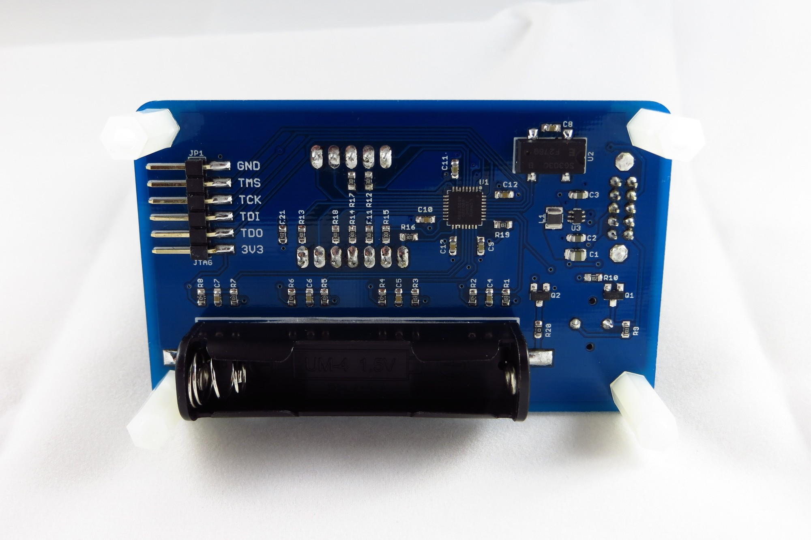
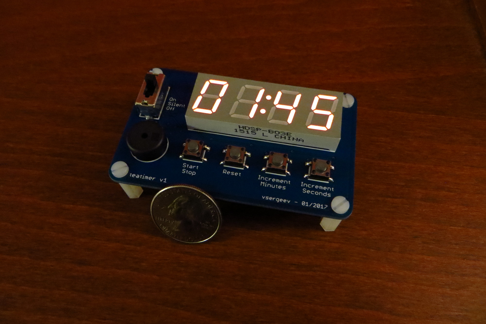
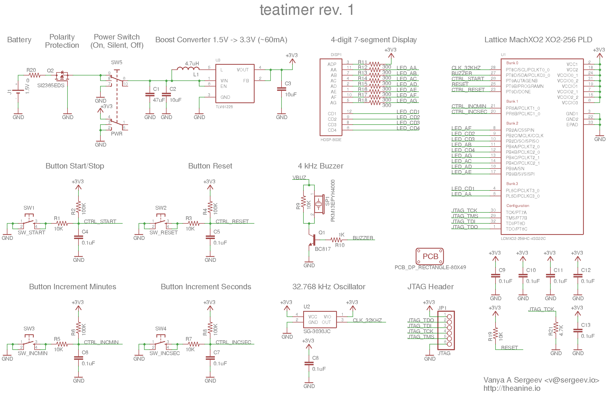
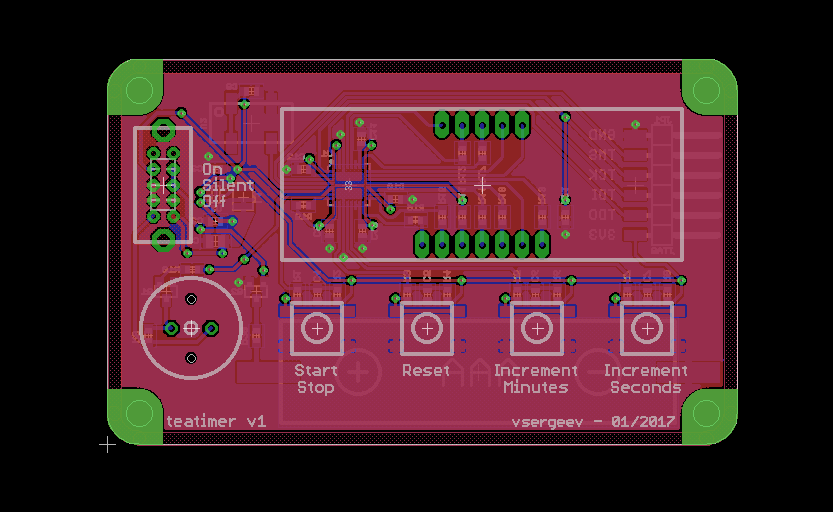

# teatimer

A simple kitchen timer implemented in digital logic on a Lattice MachXO2 CPLD.

[](https://raw.githubusercontent.com/vsergeev/teatimer/master/images/front.jpg)
[](https://raw.githubusercontent.com/vsergeev/teatimer/master/images/back.jpg)
[](https://raw.githubusercontent.com/vsergeev/teatimer/master/images/running.jpg)

(It's brighter in person.)

## Details

* Features
    * Large 7-segment display
    * Count-down/count-up timer
    * Alarm and silent modes
    * AAA battery powered
* Limitations
    * 10 hour battery life
* ICs
    * Lattice MachXO2-256 CPLD
    * SG-3030JC 32.768 kHz Oscillator
    * TLV61225 Boost Converter 1.5V -> 3.3V
* Dimensions of 80mm x 49mm
* Power consumption of ~100mA @ 1.5V (mostly from LEDs)

## Project Structure

* [`README.md`](README.md) - this README
* [`teatimer.v`](teatimer.v) - Verilog source
* [`teatimer_tb.v`](teatimer_tb.v) - Verilog test bench
* [`Makefile`](Makefile) - Makefile for simulation
* [`hw/`](hw/) - Schematic and layout
    * `teatimer.sch` - Eagle schematic
    * `teatimer.brd` - Eagle layout
    * [`teatimer-sch.png`](hw/teatimer-sch.png) - Schematic image
    * [`teatimer-brd.png`](hw/teatimer-brd.png) - Layout image
    * [`gerbers/`](hw/gerbers/) - Gerbers
* [`diamond/`](diamond/) - Lattice Diamond project
    * `teatimer.ldf` - Project file
    * `teatimer.v` - Symlinked Verilog source
    * [`teatimer.lpf`](diamond/teatimer.lpf) - Constraints
    * [`teatimer.jed`](diamond/teatimer.jed) - JEDEC bitstream
* [`misc/`](misc/) - Miscellaneous scripts

## Design Summary

The design uses 67 bits of state, 91% of the LUTs for logic, and all of the
I/O.

```
Number of registers:     67 out of   322 (21%)
   PFU registers:           63 out of   256 (25%)
   PIO registers:            4 out of    66 (6%)
Number of SLICEs:       117 out of   128 (91%)
   SLICEs as Logic/ROM:    117 out of   128 (91%)
   SLICEs as RAM:            0 out of    96 (0%)
   SLICEs as Carry:         27 out of   128 (21%)
Number of LUT4s:        232 out of   256 (91%)
   Number used as logic LUTs:        178
   Number used as distributed RAM:     0
   Number used as ripple logic:       54
   Number used as shift registers:     0
Number of PIO sites used: 18 + 4(JTAG) out of 22 (100%)
Number of block RAMs:  0 out of 0
Number of GSRs:  1 out of 1 (100%)
```

## Datasheets

* U1, Lattice MachXO2 CPLD, LCMXO2-256HC-4SG32C - [family datasheet](http://www.latticesemi.com/~/media/LatticeSemi/Documents/DataSheets/MachXO23/MachXO2FamilyDataSheet.pdf)
* U2, 32.768 kHz Oscillator, SG-3030JC32.7680KB:ROHS - [datasheet](https://support.epson.biz/td/api/doc_check.php?dl=brief_SG-3040JC)
* U3, Boost Converter, TLV61225DCKR - [datasheet](http://www.ti.com/lit/ds/symlink/tlv61225.pdf)
* DISP1, 7-segment Display, HDSP-B03E - [datasheet](https://docs.broadcom.com/docs/AV02-0568EN)
* SP1, 4kHz Buzzer, PKM13EPYH4000-A0 - [datasheet](http://search.murata.co.jp/Ceramy/image/img/w_hinm/S0040E.pdf)

## Schematic

[](hw/teatimer-sch.png)

## Layout

[](hw/teatimer-brd.png)

## Bill of Materials

| Qty | Part                      | Refdes             | Digi-key Part Number       | Total Price |
|:----|:--------------------------|:-------------------|:---------------------------|:------------|
| 1   | Lattice MachXO2-256 CPLD  | U1                 | 220-2636-ND                | 2.830       |
| 1   | Oscillator 32.768kHz      | U2                 | SG-3030JC32.7680KB:ROHS-ND | 1.398       |
| 1   | TLV61225 Boost Converter  | U3                 | 296-36756-1-ND             | 0.775       |
| 1   | NPN BJT (Buzzer Driver)   | Q1                 | BC817-40LT1GOSCT-ND        | 0.103       |
| 1   | PMOS FET (Polarity Prot.) | Q2                 | SI2365EDS-T1-GE3CT-ND      | 0.297       |
| 4   | Tactile Switch (Buttons)  | SW1-SW4            | CKN9085CT-ND               | 0.776       |
| 1   | Slide Switch (Power)      | SW5                | CKN9558-ND                 | 0.648       |
| 1   | 7-segment LED Display     | DISP1              | 516-2745-ND                | 2.821       |
| 1   | Buzzer 4kHz               | SP1                | 490-4698-ND                | 0.499       |
| 1   | Battery Connector AAA     | J1                 | 36-2466-ND                 | 0.928       |
| 1   | SMD Header 1x6            | JP1                | 952-3235-ND                | 0.711       |
| 1   | Inductor 4.7uH            | L1                 | 1276-6213-1-ND             | 0.153       |
| 1   | Capacitor 47uF 0603       | C1                 | 311-1897-1-ND              | 0.322       |
| 2   | Capacitor 10uF 0603       | C2,C3              | 587-3258-1-ND              | 0.238       |
| 10  | Capacitor 0.1uF 0603      | C4-C13             | 1276-1005-1-ND             | 0.073       |
| 6   | Resistor 10K 0603         | R1,R3,R5,R7,R9,R19 | 311-10KGRCT-ND             | 0.033       |
| 4   | Resistor 100K 0603        | R2,R4,R6,R8        | 311-100KGRCT-ND            | 0.029       |
| 1   | Resistor 1K 0603          | R10                | 311-1.0KGRCT-ND            | 0.010       |
| 1   | Resistor 4.7K 0603        | R21                | 311-4.7KGRCT-ND            | 0.010       |
| 1   | Resistor 0.0 0603         | R20                | 311-0.0GRCT-ND             | 0.010       |
| 8   | Resistor 300 0603         | R11-R18            | 311-300GRCT-ND             | 0.044       |
| 4   | Standoffs M3 16mm Nylon   | -                  | 952-2188-ND                | 1.504       |
| 4   | Screws M3 Nylon           | -                  | 36-29341-ND                | 0.748       |
| 1   | PCB Lead-free, Shipped    | -                  | -                          | 3.240       |
|     | **Total per unit**        |                    |                            | 18.20       |

Price breaks based on quantities to build 10 units. All prices in US dollars.

## Known Issues

* Silent mode is not 100% silent (design oversight)
* Limited battery life (~10 hours)

## Hardware Change Log

* v1 - 01/30/2017
    * Initial release

## RTL Change Log

* v0.1.0 - 01/30/2017
    * Initial release

## License

teatimer is [CC-BY-4.0](https://creativecommons.org/licenses/by/4.0/) licensed. See the included [LICENSE](LICENSE) file.
